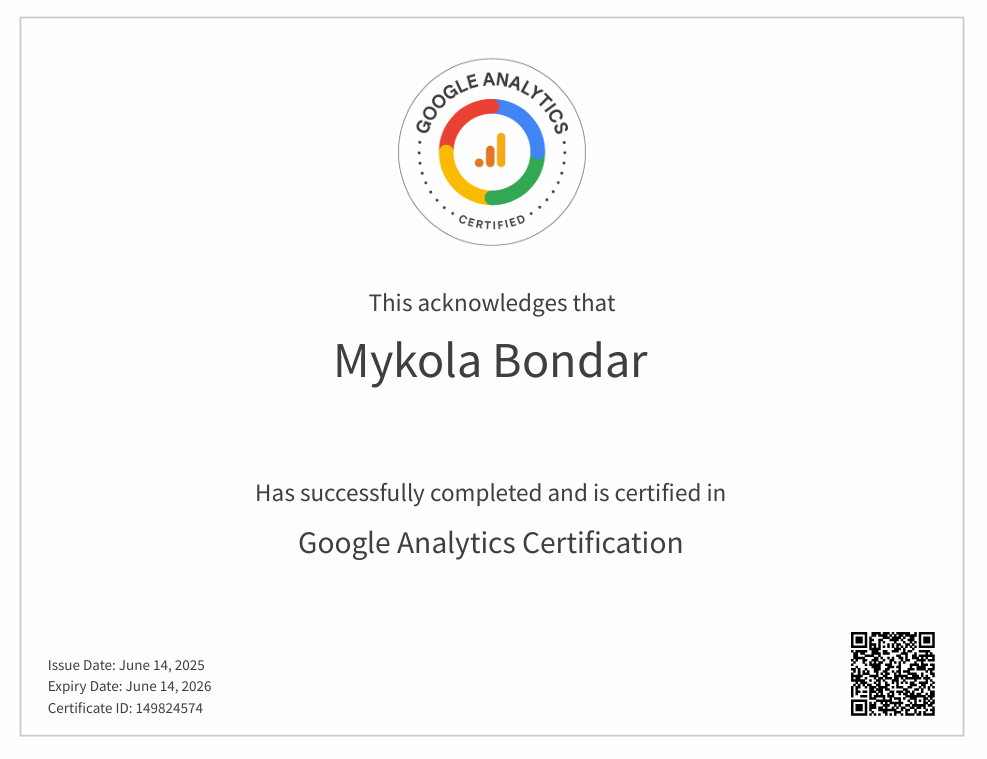

# 👋 gm, I’m **Mykola**  
### _Web3 On-Chain Analyst_ 

## 🔧 Tech Stack & Tooling  

## 🎓 Education  
**Goethe University Frankfurt** — B.Sc. _Economics & Business Administration_ 📈  

## 🎓 Certificates & Badges

| Badge | Title | Year |
| ----- | ----- | ---- |
|  | **Google Analytics Certification** | 2025 |

## 📂 Featured Projects

## 🌐 Connect With Me
 🧵  
🌿  
